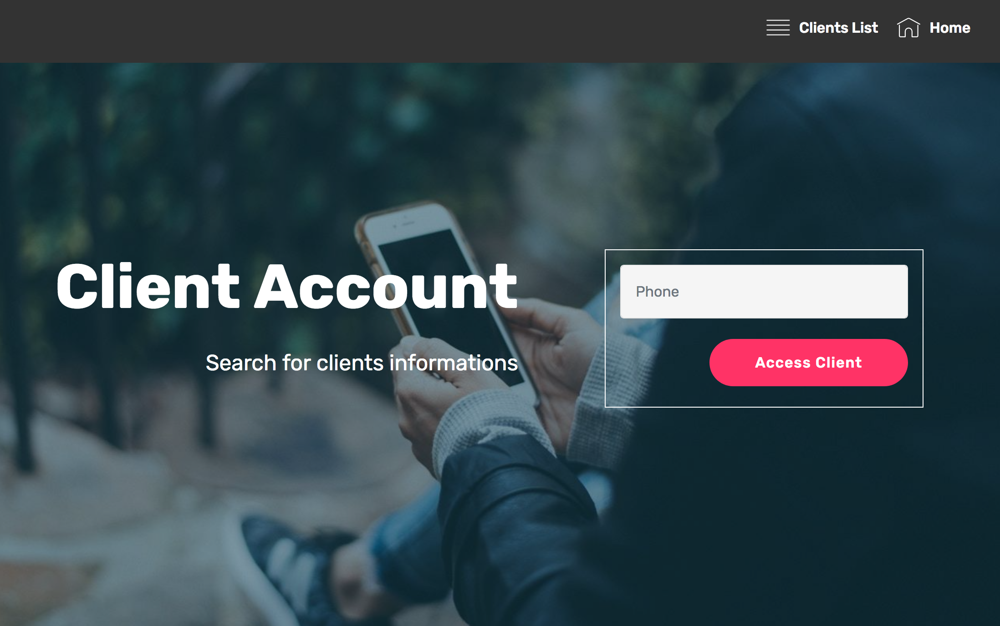

<!--   
-->
# Cloud and Data Science workshop

## Use case
Telecommunication market is expanding day by day. Companies are facing a severe loss of revenue due to increasing competition hence the loss of customers. They are trying to find the reasons of losing customers by measuring customer loyalty to regain the lost customers. The behavior of customers leaving the current company and moving to another telecom company is called **churn**.   

In the following serie of labs, you'll put yourself in the shoes of a front-end developer in charge of building a customer call-center application which should display to the operator the **likelyhood of the calling customer to churn**.  
  

The churn likelihood is giving by a predictive model that you will build, putting yourself in the shoes of a Data Scientist.  
Finally, you'll play the role of the developer in charge of integrating AI artifacts into business applications.  

Upon completion, you will have a fully functional application deployed on **IBM Cloud** consuming some sort of **AI** deployed on **IBM Watson Machine Learning Service**.  

> **Note:** Lab instructions are very well detailed, in case you struggle, ask your instructor for support.
**Good luck!**

## List of Labs

+ [1. Lab Cloud - Web Application](./labs/1.%20Lab%20Cloud%20-%20Web%20Application)

+ [2. Lab Datascience - Watson Studio](./labs/2.%20Lab%20Datascience%20-%20Watson%20Studio)  
  - [2.1. Understand your Data using Data Visualization and Prepare your Data with Data Refinery](./labs/2.%20Lab%20Datascience%20-%20Watson%20Studio/Lab1-GettingStarted.md)
  - [2.2. Create your first Predictive Model using Model Builder](./labs/2.%20Lab%20Datascience%20-%20Watson%20Studio/Lab2-WatsonML%20Model%20Builder.md)
  - [2.3. Create a Model using Flow Modeler](./labs/2.%20Lab%20Datascience%20-%20Watson%20Studio/Lab3-ModelerFlow.md)
  - [2.4. Create a Model from Jupyter Notebook using PySpark](./labs/2.%20Lab%20Datascience%20-%20Watson%20Studio/Lab4-PySparkNotebook.md)

+ [3. Lab Integration](./labs/3.%20Lab%20Integration)

## Pre-Requisites

Here is a non-exhaustive list of [pre-reqs](./prereqs).
