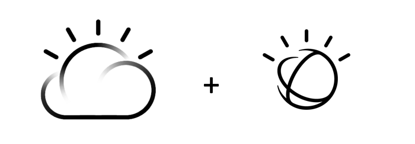

# Introduction

You will learn how to create and deploy you first app in Node.js with the IBM Cloud platform. You will also understand how to work locally with Node.js, connect to an IBM Cloud service and push your modifications to the IBM Cloud platform. 




# Objective

In the following lab, you will learn:

+ How to deploy a new Cloud Foundry app using the Node.js runtime
+ How to run a Node.js app locally
+ How to create and bind a new service 
+ How to use the IBM Cloud Command Line Interface


# Pre-Requisites

+ Get an [IBM Cloud Platform account](https://console.bluemix.net/registration/), or use an existing account.
+ Install the [IBM Cloud CLI](https://console.bluemix.net/docs/cli/reference/bluemix_cli/get_started.html#getting-started)
+ Install the [Git CLI](https://git-scm.com/downloads)
+ Install [Node.js](https://nodejs.org) to test your app locally


# Steps

1. [Create a new "hello world" web application using the web UI](#step-1---create-a-new-web-application-using-the-web-UI)
2. [Run the node.js app locally](#step-2---run-the-node.js-app-locally)
3. [Change a file locally](#step-3---change-a-file-locally)
4. [Push your local app to the cloud](#step-4---push-your-local-app-to-the-cloud)
5. [Create and bind a Watson service](#step-5---create-and-bind-a-watson-service)
6. [Use the Watson service in your app](#step-6---USe-the-Watson-service-in-your-app)


# Step 1 - Create a new "hello world" web application using the web UI

1. Log in to [IBM CLoud Platform console](https://console.bluemix.net).

1. Select the Region (e.g. United States) where you want to create your application. If needed, create an org and a space in that region.

1. Note these Region, Org and Space names, as you may need it later to target your work space.

1. Navigate to the Cloud Platform **Catalog**.

1. Look for the ***SDK for Node.js*** from the search bar and create an instance of this runtime (it is part of the Cloud Foundry App section). 

1. Give your app a unique name and unique host (e.g. nodeapp-[your-initials])

1. Wait for your application to start and click on "Visit App URL" to view your application.

The SDK for Node.js created a simple "Hello World!" web app that will become our starting point.


# Step 2 - Run the node.js app locally

1. Fork the starter source code from Git: 
  
  ```
  $ git clone https://github.com/cllebrun/starters
  ```

1. From to the directory of the starter code

  ```
  $ cd NodeJSStarter
  ```

1. Get the node.js dependencies for this project

  ```
  $ npm install
  ```

1. Start the app

  ```
  $ npm start
  ```

  The console output will look like:
  
  ```
  > NodejsStarterApp@0.0.1 start /Users/lebrun/Documents/starters/NodeJSStarter
  > node app.js
  
  To view your app, open this link in your browser: http://localhost:3000
  ```

1. Access the app with your web browser to vizualise your local node.js app


# Step 3 - Change a file locally

1. In your file directory, open and edit **public/index.html** using a code editor such as Sublime or Notepad++

1. Remove the text (l19-20) and add a Text Area and a Button on the UI:

1. Remove:

  ```
  <h1 id="message">Hello World!</h1>
  <p class='description'></p> Thanks for creating a <span class = "blue">NodeJS Starter Application</span>.
  ```
1. Replace by:

  ```
  <textarea rows="4" cols="50" class="textbox">
    Hello Watson !
  </textarea>
  <button type="button" class="speech-btn">Make me speak !</button> 
  <audio type="audio/ogg" preload="none" class="audio">audio element not supported !</audio>

  ```
1. Reload the page in your web browser to confirm the change locally

# Step 4 - Push your local app to the cloud

Cloud Foundry relies on the *manifest.yml* file to know what to do when you run the *cf push* command.
Replace with your app name (deployed on the IBM Cloud Platform) for both "name" and "host"

  ```
  applications:
  - path: .
    memory: 256M
    instances: 1
    domain: mybluemix.net
    name: <yourappname>
    host: <yourappname>
    disk_quota: 1024M
  ```

It basically defines one application taking its content from the current directory,
being deployed with **256MB**, with **one** instance, under the **mybluemix.net** domain.
The app is named **yourappname** and it is using **yourappname** as host name.
It has **1024MB** of disk space available.

1. Connect to the IBM Cloud Platform

  ```
  $ bx api <endpoint>
  ```

  Select one of the API endpoint below to target the region in which you earlier have created your app using the IBM Cloud UI (Step 1). 
  * US SOUTH: https://api.ng.bluemix.net
  * US EAST: https://api.us-east.bluemix.net
  * UK: https://api.eu-gb.bluemix.net
  * GERMANY: https://api.eu-de.bluemix.net
  * SYDNEY: https://api.au-syd.bluemix.net

  Pushing an app with the same name and host, targeting the same region, org and space in which your existing hoseted app is, that will be erased and replaced.
  
1. Connect to the IBM Cloud Platform

  ```
  $ bx api <endpoint>
  ```
  
1. Login to the IBM Cloud Platform

  ```
  $ bx login
  ```
1. Target the right org and space on the IBM Cloud Platform

  ```
  $  bx target -o [your_org_name] -s [your_space_name]
  ```

1. Push the app to the IBM Cloud Platform

  ```
  $ bx app push
  ```

1. When the command completes, access the application running in the cloud to confirm your change was deployed

  ```
  requested state: started
  instances: 1/1
  usage: 256M x 1 instances
  urls: nodeapp-[your-initials].eu-gb.mybluemix.net
  last uploaded: Thu Mar 14 15:24:17 UTC 2016
  stack: cflinuxfs2
  buildpack: SDK for Node.js(TM) (ibm-node.js-4.3.0, buildpack-v3.1-20160222-1123)

       state     since                    cpu    memory          disk          details   
  #0   running   2016-03-14 04:25:24 PM   0.0%   75.9M of 256M   92.5M of 1G      
  ```

Changing files locally and pushing them worked but we can do better.
In a previous step we set up a Git repository and a build pipeline was automatically configured.


# Step 5 - Create and bind a Watson service

To give more value to your app, you are now going to add a Text To Speech service

1. the Watson TTS service could have been provionned by running the command line, give it a name like "nodeapp-tts":

```
  $ bx cf create-service text_to_speech lite [your_service_name]

```

1. Bind the Watson service to your app:

```
  $ bx cf bind-service [your_app_name] [your_service_name]

```
1. Restage your app:

```
  $ bx cf restage [your_app_name]

```

  Your application will restart and the service connection information will be made available to your application.


# Step 6 - Use the Watson service in your app

When your application runs in Cloud Foundry, all service information bound to the application are available in the **VCAP_SERVICES** variable.

1. Update your manifest file, to make your app recognizing the binding service you have created. Add your service name at the end:

  ```
  services:
    - [your-service name]
  ```

1. Install the cfenv and watson node modules:

  ```
  npm install watson-developer-cloud --save

  ```
  ```
  npm install cfenv --save

  ```

1. In your local directory, open the app.js server side js file and add: 

  ```
  var  watson = require('watson-developer-cloud');
  var cfenv = require('cfenv');
  
  var tts_service_vcap = appEnv.services["text_to_speech"];

  if (tts_service_vcap){
    var tts_credentials = tts_service_vcap[0].credentials;
    var textToSpeech = watson.text_to_speech({
      version: 'v1',
      username: tts_credentials.username,
      password: tts_credentials.password
    });

  }
  else{ 
    // (If you nedd to do local development, replace username and password)
    var textToSpeech = watson.text_to_speech({
      version: 'v1',
      username: '<username>', // provide username from service credentials
      password: '<password>' // provide password from service credentials
    });
  }

  // Handle text to speech request from client
  app.get('/api/synthesize', function(req, res, next) {
    var transcript = textToSpeech.synthesize(req.query);
    transcript.on('response', function(response) {
      if (req.query.download) {
        response.headers['content-disposition'] = 'attachment; filename=transcript.ogg';
      }
    });
    transcript.on('error', function(error) {
      next(error);
    });
    transcript.pipe(res);
  });
  ```

1. Replace <username> and <password> by your credentials, you can run the CF command:
  ```
  bx cf env <your_app_name>

  ```
and you'll find username and password under: 

"VCAP_SERVICES": {
  "text_to_speech": [
   {
    "credentials": { ...

Note that you also have the possibility to find the credentials using the IBM Cloud UI, under your application Runtime menu -> Environment variables.

1. In your app directory, locally, create a .js file in your public folder, name it "index.js"

1. Edit the file "index.js" to add the logic to call the Watson text to speech service when you click on the button in your app web interface:

  ```
  // ****** Code snippet for index.js ***/
  /** Handle the button by invoking server side code to convert the text
  * describing personality into speech
  * Replaces periods in text with blanks as periods are converted to
  * the word "dot"
  * and blanks are ignored
  */
  $('.speech-btn').click(function(){
    console.log('listen pressed');
    var theText = $('.textbox').val();
    theText = theText.replace(/\./g,' ');
    console.log(theText);
    var streamingURL = '/api/synthesize?text='+ encodeURIComponent(theText);
    var audio = $('.audio').get(0);
    audio.src = streamingURL;
    audio.play();
    return false;
  });
  ```
1. In your index.html file, call the .js file and the ajax library by adding these two lines after the closing body HTML tag:

  ```
    <script type= "text/javascript" src="https://ajax.googleapis.com/ajax/libs/jquery/1.11.1/jquery.min.js"></script>
    <script src="index.js"></script>
  ```
1. Test your app locally:

  
  ```
  $ npm start
  ```

  The console output will look like:
  
  ```
  > NodejsStarterApp@0.0.1 start /Users/john/dev/[your_app_name]
  > node app.js
  
  server starting on http://localhost:[port-number]
  ```

1. Access the app with your web browser (turn on the volume and click on the speak button)

1. If it is working well you can now push it to the IBM Cloud Platform ! (you can remove hardcoded username and password)

# Resources

For additional resources pay close attention to the following:

- [Watson Text To Speech Documentation](https://www.ibm.com/watson/developercloud/text-to-speech.html) and https://console.bluemix.net/docs/services/text-to-speech/getting-started.html#gettingStarted