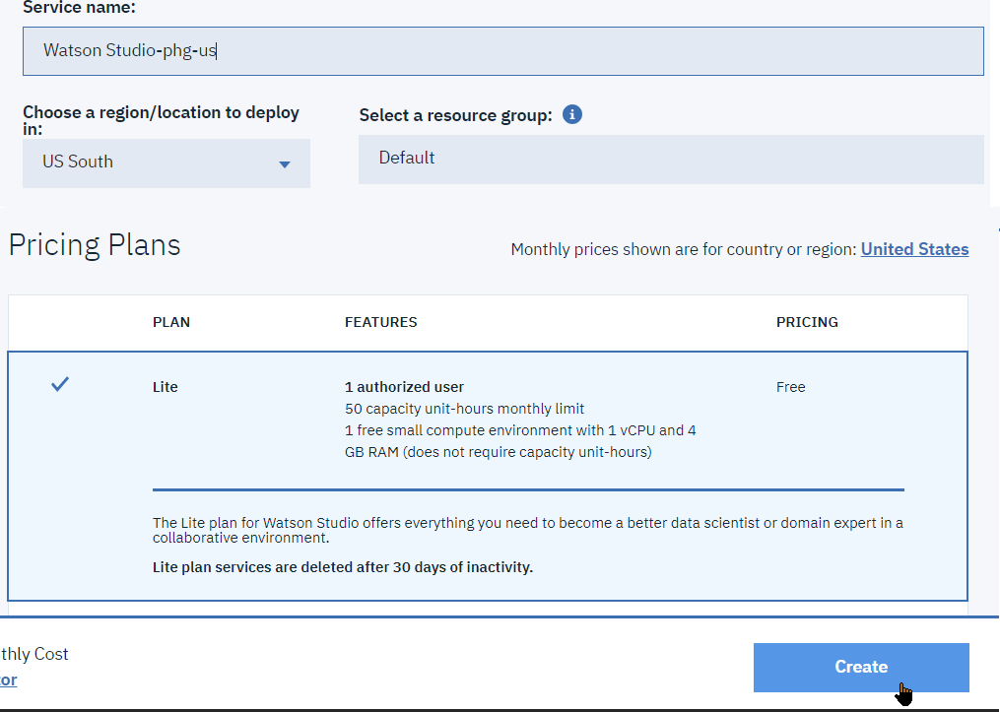
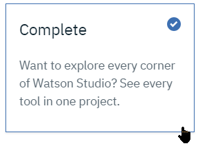
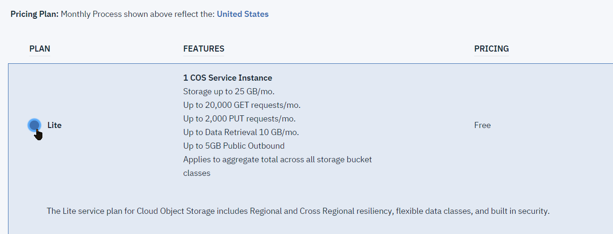
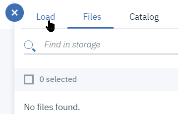
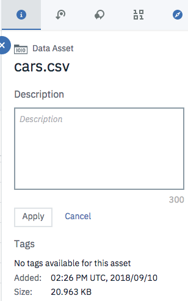

# Lab1 - Getting started on Watson Studio Hands-On

In this first Lab on **IBM Watson Studio**, we will start getting to grips with **IBM Watson Studio** projects, services, data assets, data refinery and run your first **Jupyter Notebook**.

### Setup
**IBM Watson Studio** is an IBM Cloud service, so in addition to the IBM Cloud account setup, you will need to create the **IBM Watson Studio** instance.  
In addition, **IBM Watson Studio** makes use of additional data and AI related services from the IBM Cloud platform, so we will create some artifacts for use within Watson Studio at runtime.
1. Create a Watson Studio service instance
1. Create a Watson Studio Project for the workshop.
1. Provision a set of additional services
1. Load data files into the project as Data Assets

### Creating a Watson Studio instance
From IBM Cloud, we will create a **IBM Watson Studio** service, as the anchor for the toolset within IBM Cloud. Note that this is a one-time setup, only one instance of Watson Studio per region needs to be created.
1. Log-in to you IBM Cloud account's dashboard (at https://console.bluemix.net/dashboard/apps)
2. Click the `[Create Resource]` button at the top right 
3. In the search filter field, add the single word `studio`. This should reveal the lite services having the `studio` word in their name.  and click the `Watson Studio` tile.   
> NOTE: Make sure to use **`Watson Studio`**, and ***not*** *`Knowledge Studio`*
4. You are taken to the service creation page. Although it is possible to create an instance of Watson Studio in either `US South` or `United Kingdom` regions, it is **HIGHLY recommended to use `US South`** because this is where services, including new beta ones are updated first. You can change the service name suffix or keep the suggested name. Keep the `Lite` service plan and click the `[Create]` button.

> **NOTE:** In the rest of the labs, if you created your Waston Studio instance in the `US-South` region, you will need to use the plain URLs without prefix, e.g. `dataplatform.ibm.com`, but if you created in the `United Kingdom` region, you will need to use the `eu-gb` URLs, e.g. `eu-gb.dataplatform.ibm.com`.

### Creating a Watson Studio project
Now that we have put in place the infrastructure to work with Data & AI, we can start creating a project for a specific data handling project.
1. If not already signed-in, login to your Watson Studio environment within IBM Data Platform. For this, go back to the IBM Cloud dashboard, select the `Watson Studio` service instance, and click the '[Get Started]' button .  
The first time you start the Watson Studio UI, you will be asked to confirm some details, click the `[Continue]` button , and then validate  
    
> **Note** that you can also go directly to the service's Cloud Web UI using the URL for the region where the service has been created, either https://dataplatform.ibm.com/projects?context=analytics for 'US-South' or https://eu-gb.dataplatform.ibm.com/projects?context=analytics for 'United Kingdom'  

Create a new project using the `New Project` button tile  ->     
Then select a `Complete` configuration. This governs which tools are made available to the project, and can be altered later if need be Validate with the `[OK]` button  
   

1. Name this new project e.g. `WatStud_Workshop`.   

>**Note:** that you will want to leave the 'Restrict who can be a collaborator' unchecked, it will make sharing the project with another account more straightforward.   
Watson Studio stores its file-like artifacts into an instance of `Cloud Object Storage`, we will create a COS service instance at this stage.

     

   > Currently, your only choice is **IBM Cloud Object Storage**. Information stored with **IBM Cloud Object Storage** is encrypted, resilient and dispersed across multiple geographic locations, and accessed over HTTP using a REST API.  
   Each project and catalog has its own dedicated bucket.  

   1. Select the `Lite Plan` 
   1. Accept the default names for resource group and Service name
   1. Back to the Project creation page, select Refresh then the new Object Storage service instance
   1. Finally, click **Create**.   

### Loading Data Assets for the project
We will load some of the files used during the Hands-On lab as Data Assets available to your project.   
The files are available in the Box folder.
1. In your **IBM Watson Studio** project, switch to the `Assets` tab:
2. Initially the Data Assets list should be empty. If not opened yet, open the Data Pane by selecting the `1001` icon at top right: 
3. Select the `Load` tab 
4. Click Browse to add files that you will have downloaded to your computer's disk from the Box folder.   
Among the files that we will need, you can start loading the following ones:
The source data for these files can also be found at their original lolocation on the web.   

|File name|Original location
|---|---
|`customer_churn_source.csv`|*available from the Git repository*
|`cars.csv`|https://dataplatform.cloud.ibm.com/api/exchange/actions/download-dataset/c81e9be8daf6941023b9dc86f303053b

5. Once done, the files will show up in the `Data assets` list.

## Project collaboration
One of the strengths of **IBM Watson Studio** is to allow to easily collaborate on shared projects.  

#### * Optional *
If you have for example another **IBM Cloud** account, you can add that other account as a collaborator on this `DSX_Workshop` project:   
(Or you can share this with your class neighbour)

* Select the `Add new collaborator` button   
* Enter the e-mail address of another account 
* Select an access level, Admin will allow full control, the click `Add`
* The new collaborator shows up in the summary 
* Finally click `Invite` to validate the change
* If you login with another account to IBM Cloud and another user's instance of Watson Studio, you will be abe to access this project too.

## Quick assessment of the Data Asset
You can quickly browse through sample from one of the Data Assets, so as to get an idea of the data format.

For example:
1. From the `Assets` tab in the project page, select the `cars.csv` data asset by clicking on it
2. This opens a preview of the data in tabular format. Data set has 9 columns and 406 rows.
> Note that you can change the Data Asset metadata such as the **Description** and the **Tags** from the **Information** side bar and clicking on the **pencil** to go in edit mode.

3. Now select the `Refine` button   
This will open the Data Refinery tools of **IBM Watson Studio** which allows to cleanse and shape data, customize it by filtering, sorting, combining or removing columns, and performing operations.  
NOTE: If the `[Refine]` button is not present or grayed-out, navigate to the `Tools/Data Refinery` menu , then select your project , and finally `[Add]` the intended file.
> As you manipulate your data, you build a customized data flow that you can modify in real time and save for future re-use. When you save the refined data set, you typically load it to a different location than where you read it from. In this way, your source data can remain untouched by the refinement process.

4. switch to the `Vizualisations` tab in the view that opens 
5. in COLUMNS TO VISUALIZE, enter `mpg`, then `(+) Add column` and `horsepower`. Then select a graph type of `Scatterplot`

6. the graph plots the two data columns to show their relationship. We will see in the Visualization Hands-On Lab how to programatically generate a similar graph.

7. On the left panel, you can modify the coloring of the dots according to `acceleration` , and their color according to number of `cylinders`: 
8. Finally, notice that the legend gauges on the right side are active and allow to filter the represented dataset, here we show only 2-4 cylinder cars: 

### Interpretation of the horsepower/mpg scatter plot
Scatter plots are very useful diagrams to quickly show if there is a relationship between two atributes.   
Here we see that there is a general trend that cars with higher horsepower tend to have lower miles-per-gallon. This is kind of an expected outcome.   
But we also see that the curve is not quite a straight line, it looks more hyperbolic.   
Moreover, some points are clearly not on the general trend, these are called **'outliers'**. You can hover at the point at `{hp: 132, mpg: 32.7}`, or `{hp: 15, mpg: 72}` for example.   

## Data Refinery
The Data Refinery in **IBM Watson Studio** is an integrated light ETL feature which allows to easily implement data transformation pipelines in  the form of a sequence of data operations applied to a data set called **data flows**.

In this section, we will use Data Refinery to cleanse and filter the contents of the `customer_churn_source.csv` data file.   
This file is an historical consumption of customers of a Telecommunication Provider.   
We will use **IBM Watson Studio** to get a first understanding of the data, and apply some transformations to reduce the volume and scope of data to analyze.
> Note that this file isn't pretty large, but **IBM Watson Studio** can work on very large datasets. The transformations that you will build are steps of a Data Flow and show in 'realtime' on a preview of the data. Once the data flow completed, you can schedule it and run on the whole dataset.

1. From your project's `Assets` tab, scroll down to the `Data Flows` section and select `New data flow`:   
1. Select the `customer_churn_source.csv` data file, click on the small eye icon to have a preview, then click the `Add` button at the bottom right. Note that if the `[Add]` button is not active, you will have to select `[Add]` from the main panel.
1. Data Refinery will show a table with the 1000 first rows as a sample. As part of the operations we will want to apply to the data, we will:
    1. Remove unnecessary columns
    2. Rename the columns so as to remove blanks that could cause handling issues later on
    3. Specify actual data types for non-string fields. This applies to the numeric 'Children', 'Est Income', 'International', 'Age', 'LongDistance', 'International', 'Local', 'Dropped'.
    4. Compute an 'Usage' column from the 'LongDistance', 'International', 'Local' columns.

    > Notice that as you perform data transformations, the steps of your data flow are added on the left side bar.   

### 1. Column removal:
1. Scroll to the very right of your data set. You may have a column named `ADDED_COLUMN` which might be the result of a trailing blank or comma during the CSV creation.

2. Click the three dots next to the column name and the `Remove` on the operations list.

> Note the addition of the first step of your data flow.

### 2. Columns renaming:
1. For the first column, select the `Add Operation` icon, then the `Rename` operation, and replace the column name by the same with spaces replaced by underscores, e.g. `Est Income` becomes `Est_Income`.  
   
>NOTE that it's a good idea to cut the column name before clicking the `Next` button so as to save retyping it.   

2. For the other columns, there is a faster way to add a rename operation, by clicking the **pencil** icon in the column header and changing the name there:  
  

As you proceed through columns renaming, you will see operations being listed in the right-hand side panel. After renaming you should see three operations.  

 **Save** you work with the Disk icon.     

### 3. Data type changes
1. Now add `Convert Column type` operations for `Children`, `Est Income`, `International`, `Age`, `LongDistance`, `International`, `Local`, `Dropped`, `RatePlan` columns: .
1. Select `Integer` as the target type for `Children`. Leave the `Create new column` unselected:   
You can add the operation either from the `[+ Operation]` button at the top left, or from the column's header context menu: .
> Note in this case how the `Decimal` type is suggested with a small blue dot at its left.

1. Do the same for the remaining columns `International`, `Age`, `LongDistance`, `International`, `Local` being a `Decimal`, `Dropped` and `RatePlan` being an `Integer`.
2. After completing those changes, you should have 11 steps in your data flow.

### 3. Feature Engineering: Additional computed column
We will compute the `Usage` from three `Local`, `International`, `LongDistance` columns. This will give the **overall consumption of the customer**.
You will do that writing an `R expression` in the *Code an operation* text zone.
  

1. Type the following expression in the text zone.  
`mutate(Usage = International + Local + LongDistance)`
2. Click `Apply` to validate the expression. This will add the `Usage` column to the dataset prefetched with the result of the calculation.

> Note that at each step, you can see a preview of the data in the table.
Verify that the values for `Usage` column is correct in the preview.

Also note that here we've used the UI-driven point-and-click style column ETL operations. It is also possible to add column operations using the guided formula operations entry at the top of the table preview.   

You should now have 28 steps defined.   
**Save** your flow.

### 5. Data Cleansing: remove columns with no Birth_Date
Some columns are missing the Birth_Year demographics information. We will remove the rows that have this field empty.   
Note that we could (and maybe should) have added this step before computing the Age column.

1. From the `Birth_Year` column header context menu, select the `Remove empty rows` operation: 

You should now have 12 steps defined.

### Apply Data Flow pipeline to the input files
We will now process the entire file with our data cleansing and feature engineering pipeline.   

1. Click on the `Run` icon at the top right: 
1. Change the output target file name to `customer_churn` clicking on `Edit Output`, and use format as `CSV`
   > The Parquet format has the advantage of retaining  more type information than CSV for the columns, so we will not have to redefine type conversions later on.  

1. Finally click the `Save and Run` button: 
> Notice that you could have schedule your data flow to run on a defined time of the day.  

1. Select `View flow` on the next window: 
1. Wait for the flow to complete processing. The flow executes in the Spark engine and should take less than a minute to execute over the 700 thousands records.
> Note: we are working on a very small data set here of 2066 records only.  

1. Once executed, you can go back to the project assets, and you will find the generated `customer_churn` file that you can preview by clicking on it. We will reuse this file in the following part of the Labs.
1. The same processing pipeline could be applied to another file than the one used to create the Data Flow, using the `Change Data Asset` button

> You have completed the Data Refinery section, the following text recaps the Data Refinery capabilities and makes note of the different file formats supported. You can read those for informational purpose or skip those and **progress directly to the remaining section of this lab** where you will run your first **Jupyter Notebook**.

### Conclusion of Data Refinery section
We have experienced the Data Refinery which is Watson Studio's integrated ETL (Extract, Transform and Load) tool. You have seen that the tool is designed to define ETL operations without coding, even though it can be complemented by formulas.

In a Data Science pipeline, ETL tools are almost always required as first steps in the data processing. It allows to perform Data Cleansing and Feature Engineering.

#### A word on file type conversion
Data Refinery also allows to generate data Asset output in 'Parquet' or `Avro` file formats, which are file formats specified as part of the Apache Hadoop project, optimized for respectively column and row-oriented  data storage and retrieval in a Hadoop or more generally Data Science environment.   
Parquet is not as efficient as zipping a file, but can readily be used by data processing tools, and it carries meta data information such as column types.   
In the case of this input file, the resulting parquet conversion would yield a file of about 42 MB, vs 116 MB for the raw CSV file and 23 MB for the zipped CSV.

## Using notebooks for data exploration
In this section, we will start exploring the data from a file which holds the car data you used earlier by this time using a Jupyter notebook.

This is a different approach to data analysis than the GUI-driven tools such as Data Refinery, here the paradigm is to perform programmatic operations on data files rather than GUI driven.   
Each approach has its pros and cons, and selecting one versus the other can be a matter of personal preferences.

### Explore the data set
Ensure that the `cars.csv` file is part of the data assets, so that we can start to have a look at the data:

1. You will now use the `Visualize_car_data_with_Brunel.ipynb` notebook for data analysis:
   1. Go back to the Project page
   1. In the `Notebooks` section, select `[(+) New notebook]`: 
   1. Select the `From file` tab, scroll down to `Choose file` and select the `Visualize_car_data_with_Brunel.ipynb` file 
   1. For this first lab, we'll use a plain Python Jupyter notebook:
      In the bottom-right section below, select the `Default Python 3.5 Free` runtime environment: 
      (We will use a Spark environment in a later lab).
   1. **Open** the notebook. From that point on, follow the instructions that are within the Notebook. **You will have to retrieve the files from the data assets.**
   1. Once the Notebook is open, create an empty `Code` cell and position your cursor inside the cell.
   1. From the right pane, select the `cars.csv` file and select `Insert Credentials`
   
   1. This will insert the `Credentials` to read the file. Rename if needed the variable to `credentials_1` and execute the cell either clicking `Run` button from the toolbar or pressing `Ctrl + Enter`.
   
   1. From that point on, read the Notebook and run the cells in sequence typing `Ctrl + Enter`.

   You have now completed the First Lab.
