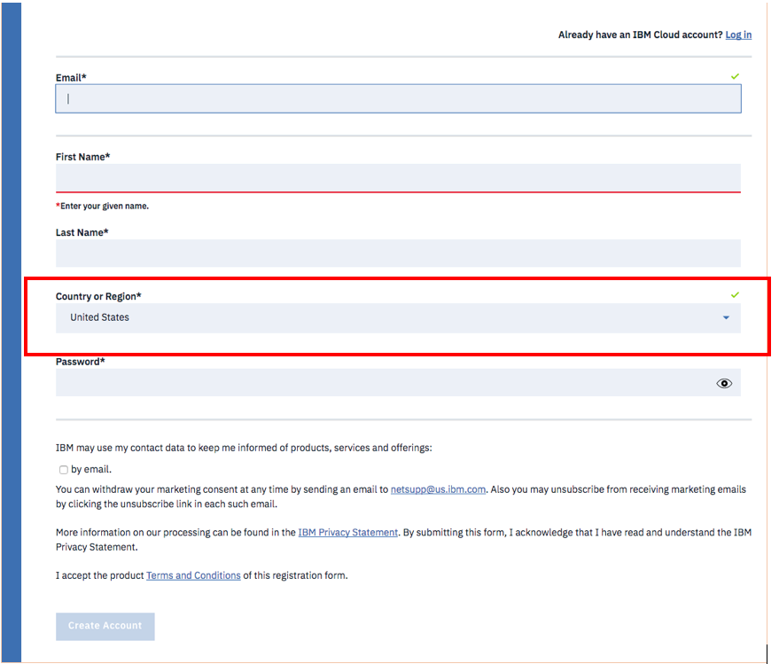

# Pre-Requisites

## User Accounts

+ You must create an account on the IBM Cloud Platform.

+ If you do not have an account yet, follow this link to register, using your IBM id: [https://bluemix.net/registration](https://bluemix.net/registration)

+ You’ll be registered for a lite account with no time restrictions, please chose US region.



## IBM CLoud Command Line Interface 

+ You will use the IBM Cloud commands to create, update and deploy your apps.

+ You can download an installer from here:
  [https://console.bluemix.net/docs/cli/reference/bluemix_cli/get_started.html#getting-started](https://console.bluemix.net/docs/cli/reference/bluemix_cli/get_started.html#getting-started)

+ Select the latest version corresponding to your operating system.


## Node and Web Development

+ Node.js is a JavaScript runtime built on Chrome's V8 JavaScript engine.
  npm, the package manager for JavaScript is installed with Node.js
  Download the latest stable version 4.X
  [https://nodejs.org/en/download/](https://nodejs.org/en/download/)


## Git

+ Git is a distributed version control system where every developers' working copy of the code is also a repo that can contain the full history of all changes.
  [https://git-scm.com/downloads](https://git-scm.com/downloads)


## IDE / Text editors

There are several modern, open source text editor that understands web design. Select your favorite development environment. Here are some suggestions:

+ Notepadd++ [https://notepad-plus-plus.org/download/v7.2.1.html](https://notepad-plus-plus.org/download/v7.2.1.html)

+ Atom [https://atom.io/](https://atom.io)

+ Sublime [https://www.sublimetext.com/3](https://www.sublimetext.com/3)

==================================================================

## Proxy

  If you have an HTTP proxy server on your network between a host running a command lne CLI (e.g. CF) and your Cloud Foundry API endpoint, you must set a proxy variable with the hostname or IP address of the proxy server.

### Cloud Foundy Proxy

  For Cloud Foundry API endpoint, you must set https_proxy with the hostname or IP address of the proxy server.
  
  ```set https_proxy=http://<your.company.proxy>:8080```

  For more information, go to [https://docs.cloudfoundry.org/cf-cli/http-proxy.html](https://docs.cloudfoundry.org/cf-cli/http-proxy.html)
  
  To test if your proxy works, run the following command:
  
  ```bx api https://api.ng.bluemix.net```

### Git Proxy
  
  ```set http.proxy=http://<your.company.proxy>:8080```
  
  To set permanently the proxy:
  ```git config --global http.proxy http://<your.company.proxy>:8080```
  
  To remove it:
  ```git config --global --unset http.proxy```
  
  To test if your proxy works, run the following command:
  
  ```git clone https://hub.jazz.net/git/f103544/textProxy```